# T1A2-portfolio-

## Table of contents 
- Purpose
- Functionality / features
- Sitemap
- Screenshots
- Target audience
- Tech stack 

### Purpose 
The purpose of T1A2 is to use HTML and CSS to create a responsive web portfolio featuring 4 HTML and CSS components and 4 graphic and/or animation features to the corresponding. This web portfolio, for most is our first step into our professional portfolio as software engineers. 

#### Functionality 
Across all .html pages, there is a responsive navigation bar for Desktop, Ipad and Iphone. The homepage/index.html has a button feature, which is styled with my name and graphics. The button acts as an alternative way to enter the website, with a link into the blog gallery.  

All the buttons on the page are styled with pseudo classes. The graphics show a continual transition of pastel colours. When the cursor is applied to the button, the text “amy” increases in size. In the Blog gallery, there are previews of each article, noting the author and publish date of the post. Furthermore, upon hovering on the preview, the text increase for readability. This is applied to each of the five article previews. The navigation bar features colour when the cursor is applied. 

The cursor has been set to change to pointer, on all clickable elements and links throughout the website. 

In the about.html there is a headshot, that has been styled into a circle - the reason behind this is for uniformity in design. There is an image on each article page. 

The contact page features a responsive form, which links to my GitHub and Linkedin accounts. 

Finally, there is a footer on each html page. 

##### Sitemap 
This is a detailed flowchart of my portfolio and it's components.
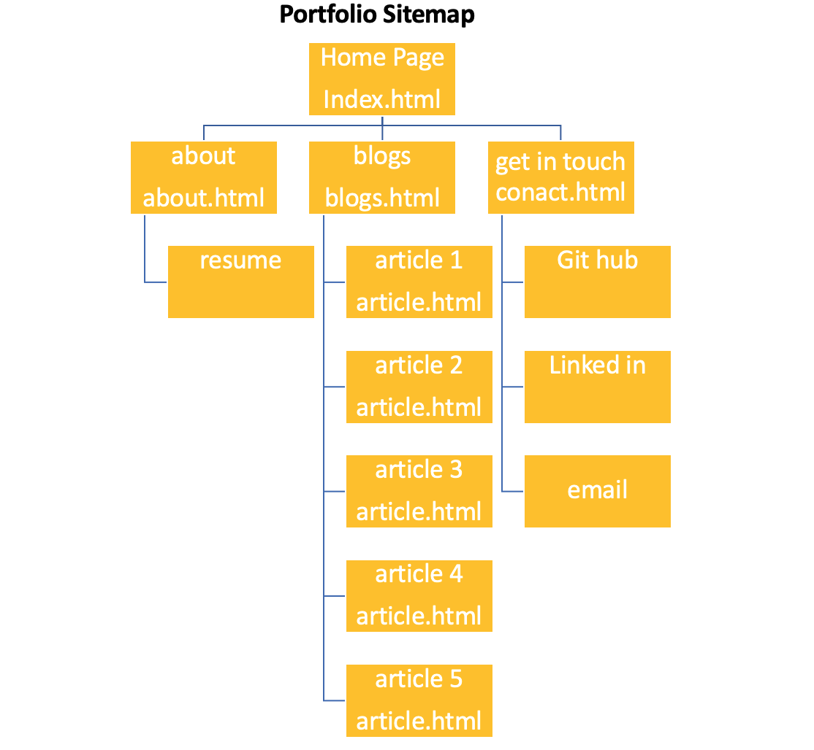

###### Screenshots 
Below are screenshots of my portfolio website, showing a responsive navigation bar. 

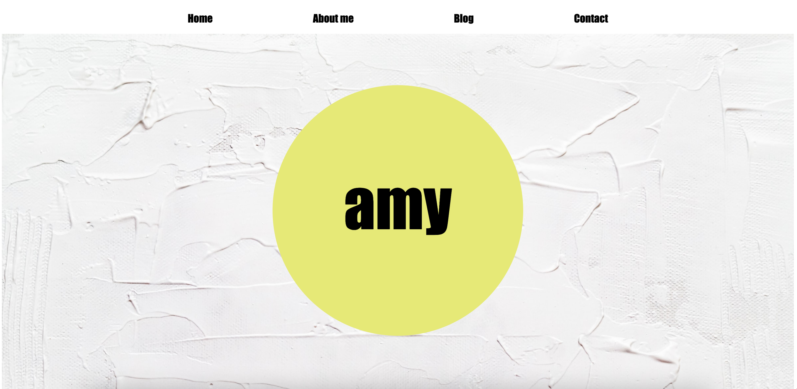
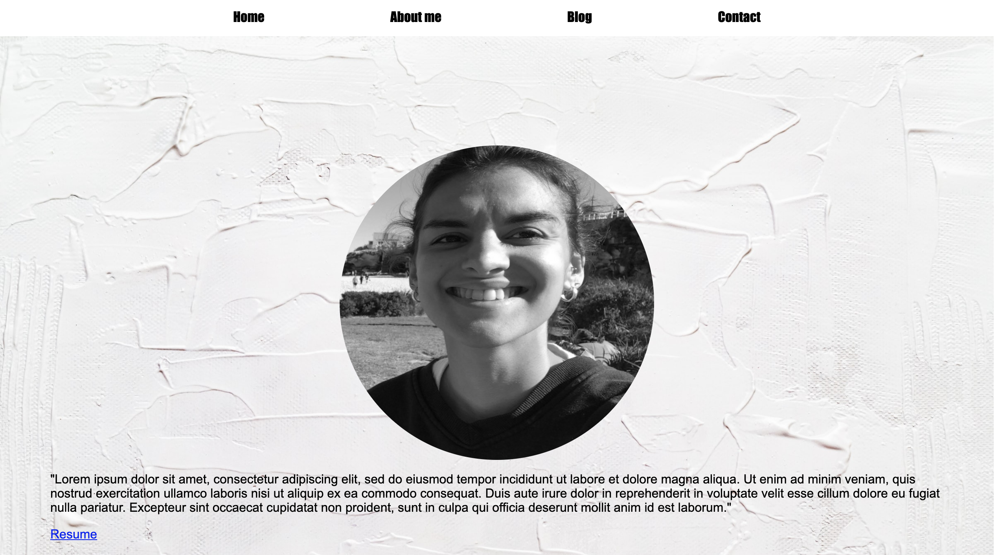
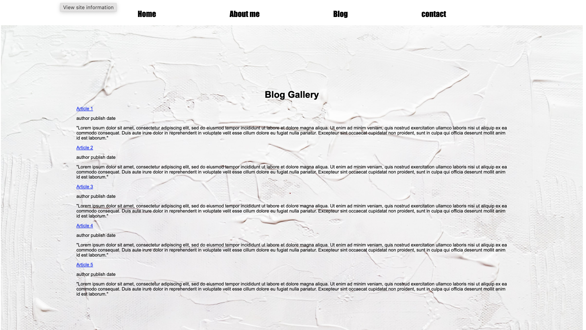
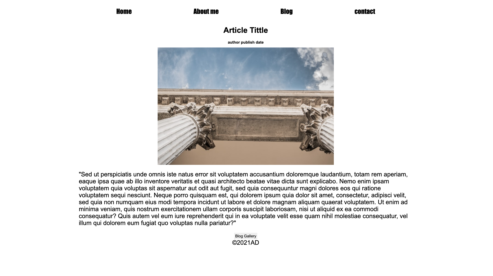
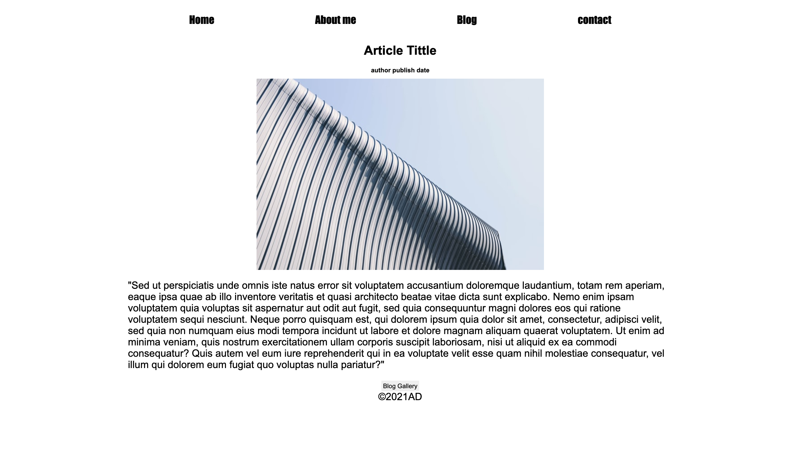
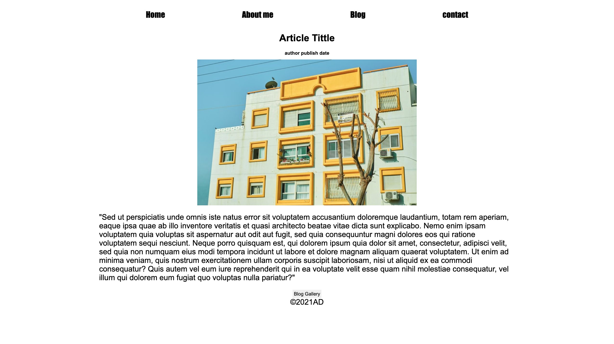
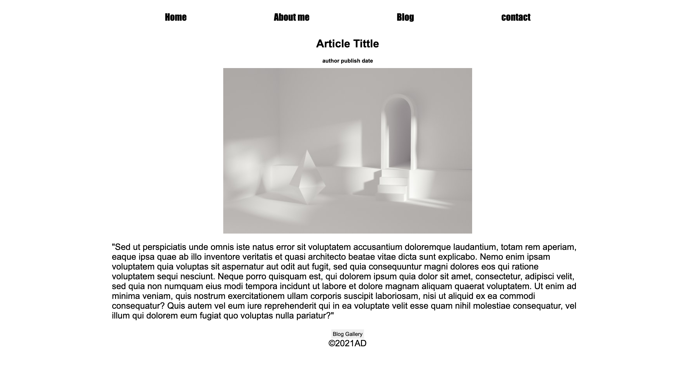
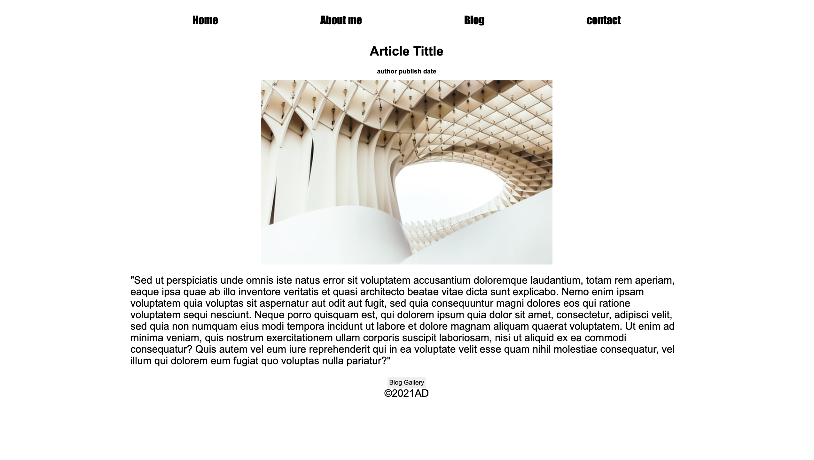
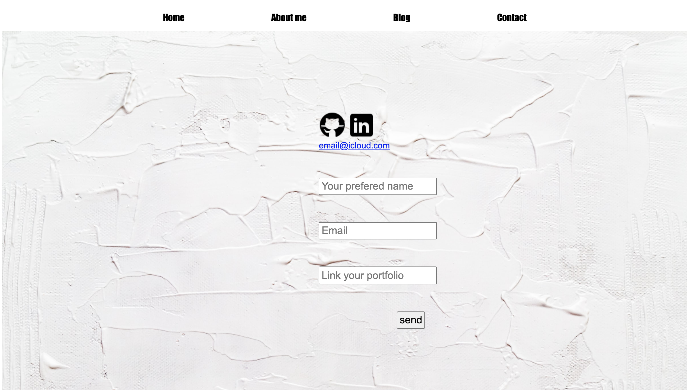
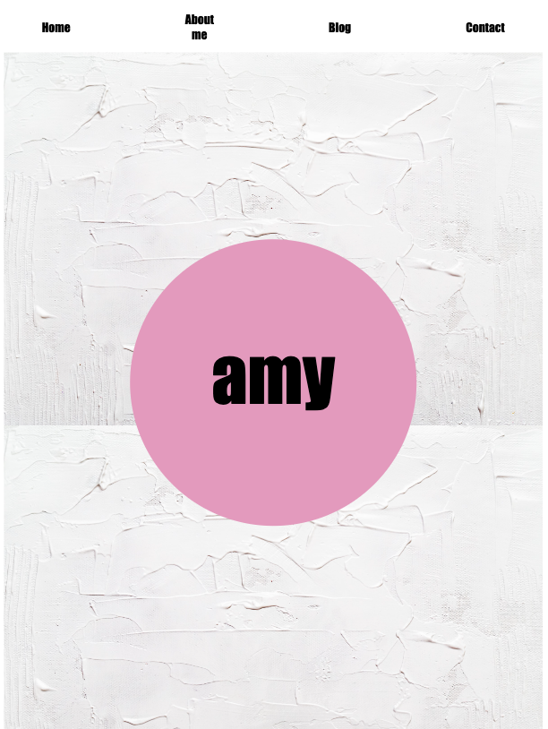
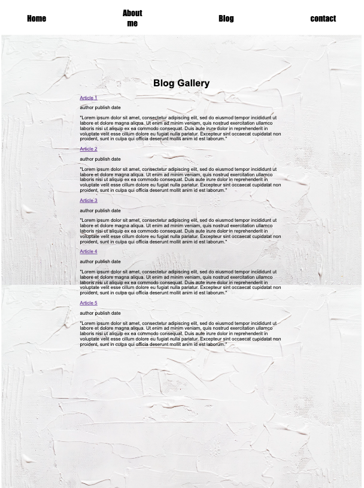
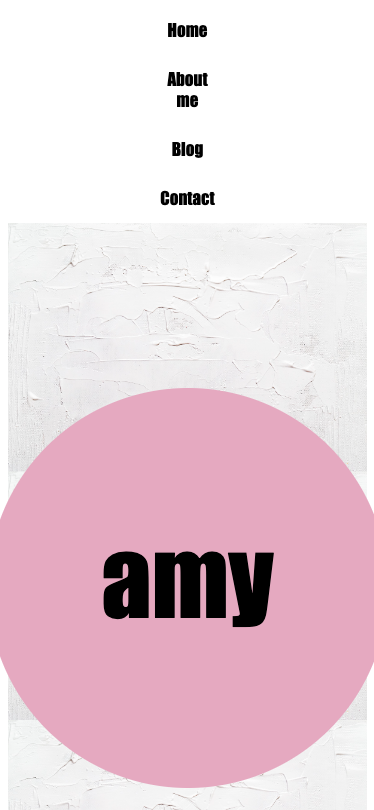
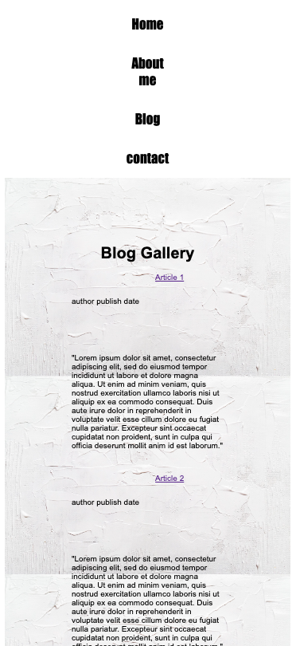

